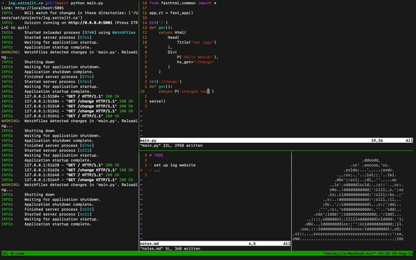

<!--

- 🔭 I’m currently working on ...
- 🌱 I’m currently learning ...
- 👯 I’m looking to collaborate on ...
- 🤔 I’m looking for help with ...
- 💬 Ask me about ...
- 📫 How to reach me: ...
- 😄 Pronouns: ...
- ⚡ Fun fact: ...

-->

<h3 align="left"><samp>hello there! i am <b><a rel="nofollow noopener noreferrer" target="_blank" href="https://www.satrajit.ca">sat.</a></b> _</samp></h3>

🔭 **presently working with cool insurance things at the intact data lab as an ai developer!** \
💼 previous swe experiences at kpmg, intact, rbc & university of ottawa.

🐧 [**i use nix btw**](https://github.com/wise-bit/dotfiles/tree/main/nixos)

### ⚡ Currently Working On

| project | ver | | 
| --- | --- | --- |
| [f-bank](https://github.com/wise-bit/fantasy-bank) | v0.9 | decentralized fantasy bank aimed towards dnd campaigns |
| [logs](https://github.com/wise-bit/log.satrajit.ca) | v0.1 | fasthtml project |
| [clites](https://github.com/wise-bit/clites) | wip | easy-to-run cli notes |
 
### 📫 Contact
<b><a rel="nofollow noopener noreferrer" target="_blank" href="https://www.linkedin.com/in/satrajit-c">linkedin</a></b> // <b><a rel="nofollow noopener noreferrer" target="_blank" href="mailto:satrajit314@gmail.com">email</a></b> // <b><a rel="nofollow noopener noreferrer" target="_blank" href="https://satrajit.ca">website</a></b>

### ✊ Support

